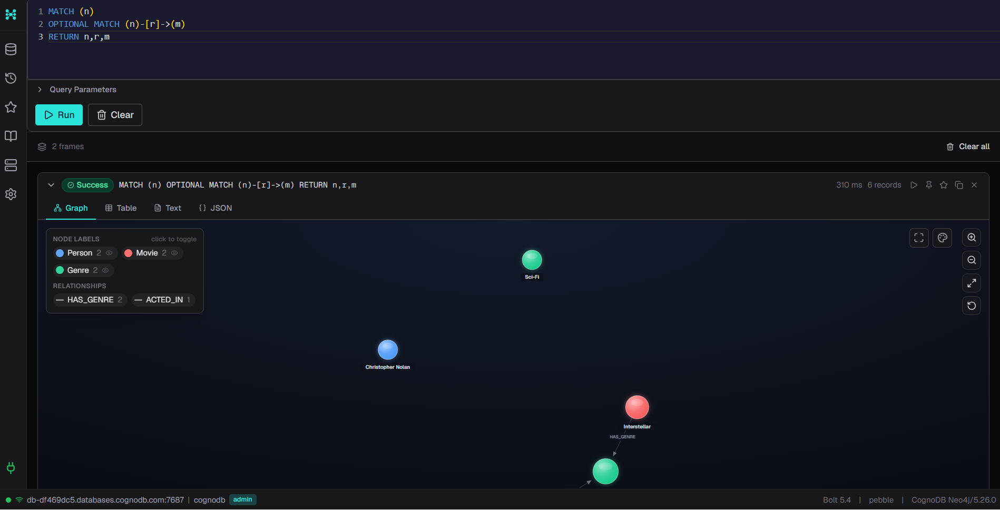
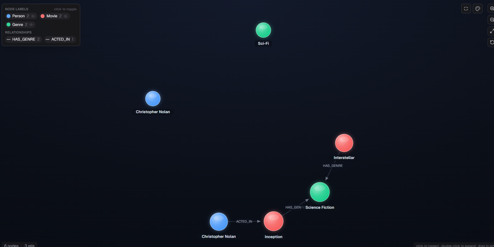
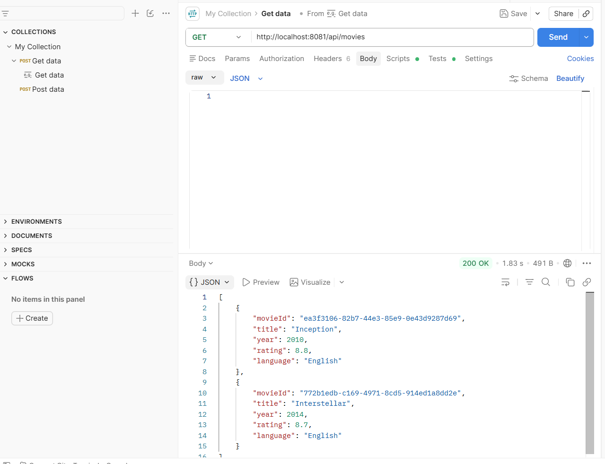
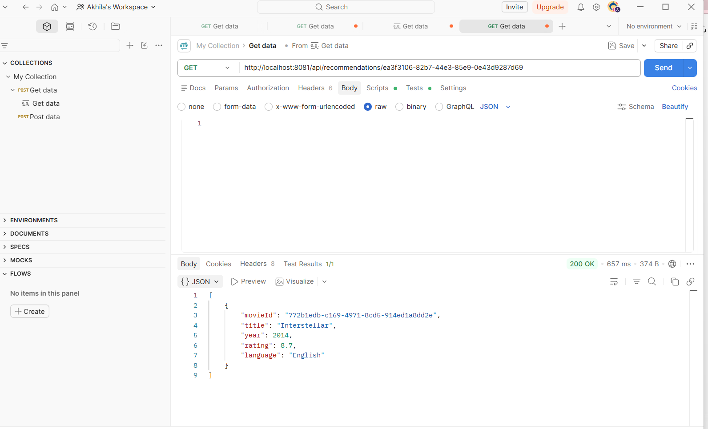
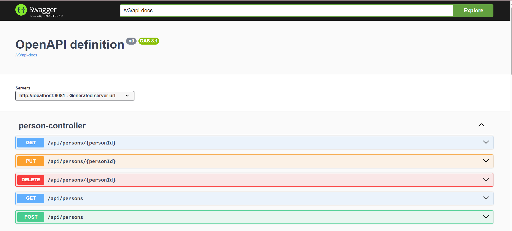
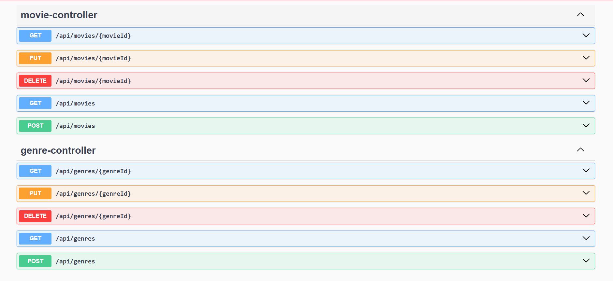
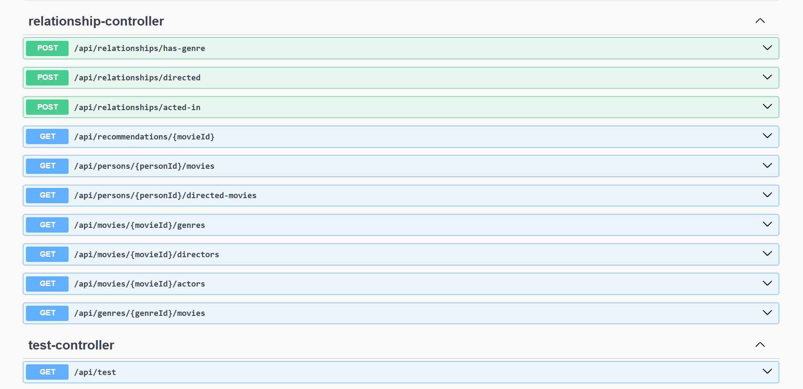
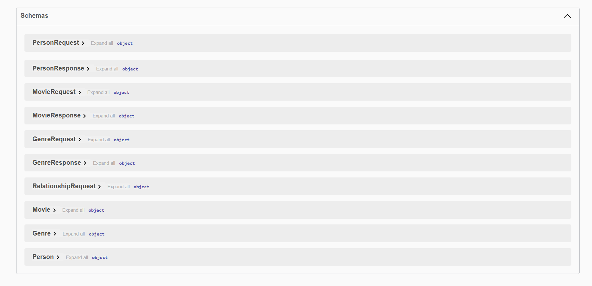

# 🎬 MovieGraph – Graph Database Movie Recommendation System

A full-stack Movie Recommendation System built using **Spring Boot**, **React**, and **CognoDB (Neo4j-compatible Graph Database)**. The application demonstrates graph database modeling by managing Movies, Persons, Genres, and their relationships while providing movie recommendations through graph traversal.

---

# 🚀 Live Demo

### Frontend (Vercel)

https://movie-graph-frontend.vercel.app

### Backend API (Render)

https://moviegraph-backend.onrender.com

### Swagger Documentation

https://moviegraph-backend.onrender.com/swagger-ui/index.html

### Screen Recording

**Add your Google Drive or YouTube Unlisted link here**

---

# 📖 Why Graph Database?

Movie recommendation systems naturally involve highly connected data such as movies, actors, directors, and genres.

Instead of using multiple SQL JOIN operations, a graph database stores these relationships directly.

This makes it easier and faster to answer questions like:

- Which actors acted in a movie?
- Which movies belong to the same genre?
- Which movies were directed by the same director?
- Recommend movies with similar genres.

Graph databases provide efficient relationship traversal and are well suited for recommendation systems.

---

# 🏗️ Data Model

```
(Person)
   │
   ├── ACTED_IN
   │
   ├── DIRECTED
   │
(Movie)
   │
   └── HAS_GENRE
        │
     (Genre)
```

---

# ✨ Features

## Movies

- Add Movie
- View Movies
- Update Movie
- Delete Movie
- Search Movies

## Persons

- Add Person
- View Persons
- Update Person
- Delete Person
- Search Persons

## Genres

- Add Genre
- View Genres
- Update Genre
- Delete Genre

## Relationships

- ACTED_IN
- DIRECTED
- HAS_GENRE

## Recommendations

- Recommend similar movies based on shared genres

---

# 🛠️ Tech Stack

### Backend

- Java 21
- Spring Boot
- Maven
- Neo4j Java Driver
- Swagger/OpenAPI
- Jakarta Validation
- Lombok

### Frontend

- React
- Axios
- Bootstrap

### Database

- CognoDB (Neo4j Compatible Graph Database)

### Deployment

- Render (Backend)
- Vercel (Frontend)

---

# 📁 Project Structure

```
src
├── controller
├── dto
├── exception
├── model
├── repository
├── service
├── config
└── util
```

---

# 📌 API Endpoints

## Movies

| Method | Endpoint |
|----------|-------------------------|
| POST | /api/movies |
| GET | /api/movies |
| GET | /api/movies/{movieId} |
| PUT | /api/movies/{movieId} |
| DELETE | /api/movies/{movieId} |

---

## Persons

| Method | Endpoint |
|----------|---------------------------|
| POST | /api/persons |
| GET | /api/persons |
| GET | /api/persons/{personId} |
| PUT | /api/persons/{personId} |
| DELETE | /api/persons/{personId} |

---

## Genres

| Method | Endpoint |
|----------|---------------------------|
| POST | /api/genres |
| GET | /api/genres |
| GET | /api/genres/{genreId} |
| PUT | /api/genres/{genreId} |
| DELETE | /api/genres/{genreId} |

---

## Relationships

| Method | Endpoint |
|----------|------------------------------------------|
| POST | /api/relationships/acted-in |
| POST | /api/relationships/directed |
| POST | /api/relationships/has-genre |

---

## Graph Queries

| Method | Endpoint |
|----------|-------------------------------------------|
| GET | /api/movies/{movieId}/actors |
| GET | /api/persons/{personId}/movies |
| GET | /api/movies/{movieId}/directors |
| GET | /api/persons/{personId}/directed-movies |
| GET | /api/movies/{movieId}/genres |
| GET | /api/genres/{genreId}/movies |

---

## Recommendations

| Method | Endpoint |
|----------|---------------------------------------|
| GET | /api/recommendations/{movieId} |

---

# 🔍 Sample Cypher Queries

### Find Actors of a Movie

```cypher
MATCH (p:Person)-[:ACTED_IN]->(m:Movie {movieId:$movieId})
RETURN p;
```

### Find Movies by a Person

```cypher
MATCH (p:Person)-[:ACTED_IN|DIRECTED]->(m:Movie)
WHERE p.personId=$personId
RETURN m;
```

### Find Genres of a Movie

```cypher
MATCH (m:Movie)-[:HAS_GENRE]->(g:Genre)
WHERE m.movieId=$movieId
RETURN g;
```

### Recommend Similar Movies

```cypher
MATCH (m:Movie)-[:HAS_GENRE]->(g:Genre)<-[:HAS_GENRE]-(recommended:Movie)
WHERE m.movieId=$movieId
AND recommended.movieId <> $movieId
RETURN DISTINCT recommended;
```

---

# ⚙️ Setup Instructions

## Clone Repository

```bash
git clone https://github.com/Akhila34567/MovieGraph-Backend.git
```

## Navigate to Project

```bash
cd MovieGraph-Backend
```

## Configure Environment Variables

```
COGNODB_URI=your_database_uri

COGNODB_USERNAME=your_username

COGNODB_PASSWORD=your_password
```

## Run the Application

```bash
mvn clean install

mvn spring-boot:run
```

Backend runs on:

```
http://localhost:8081
```

Swagger:

```
http://localhost:8081/swagger-ui/index.html
```

---

# 📸 Application Screenshots

# 📸 Application Screenshots

## 🏠 Graph Database Visualization



---

## 🌐 Graph Relationships



---

## 🎬 Movies API



---

## ⭐ Recommendations API



---

## 📖 Swagger UI - Movies



---

## 📖 Swagger UI - Persons



---

## 📖 Swagger UI - Genres



---

## 📖 Swagger UI - Relationships


# 🎥 Demo Video

https://www.loom.com/share/501688ee609643588983568683e718dd

---

# 🚀 Future Enhancements

- User Authentication
- Role-Based Access
- Docker Support
- Unit Testing
- Integration Testing
- CI/CD Pipeline
- Advanced Recommendation Algorithms

---

# 👩‍💻 Author

**Karatlapally Akhila**

GitHub

https://github.com/Akhila34567

LinkedIn

https://www.linkedin.com/in/akhila-karatlapally-ba773b2a4

---

⭐ If you found this project useful, feel free to star the repository.
